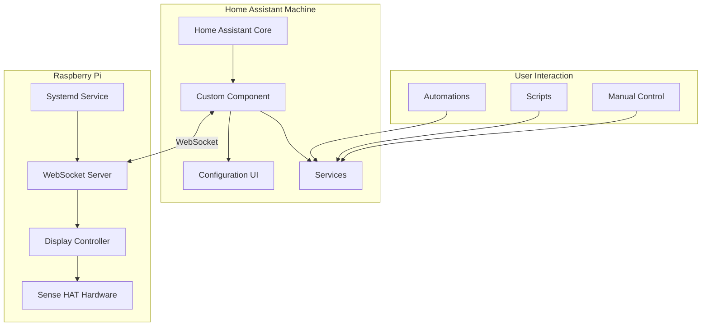
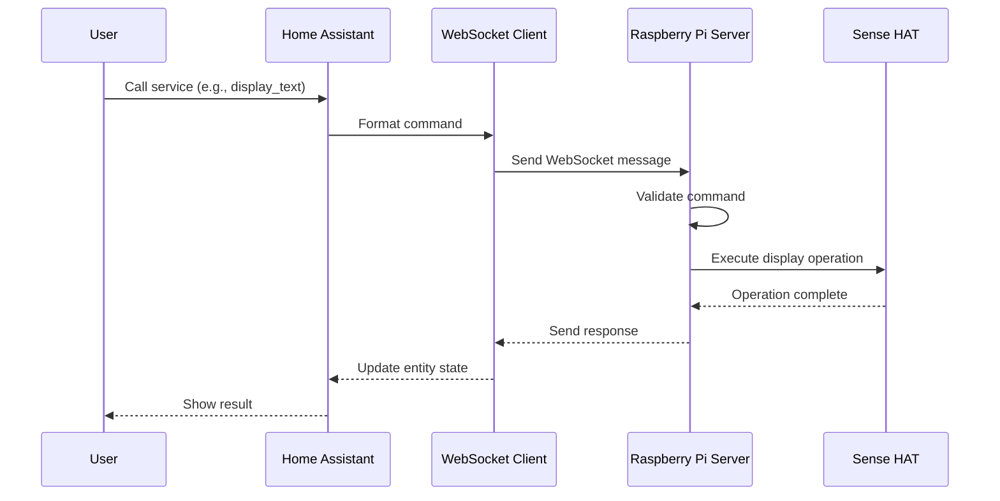
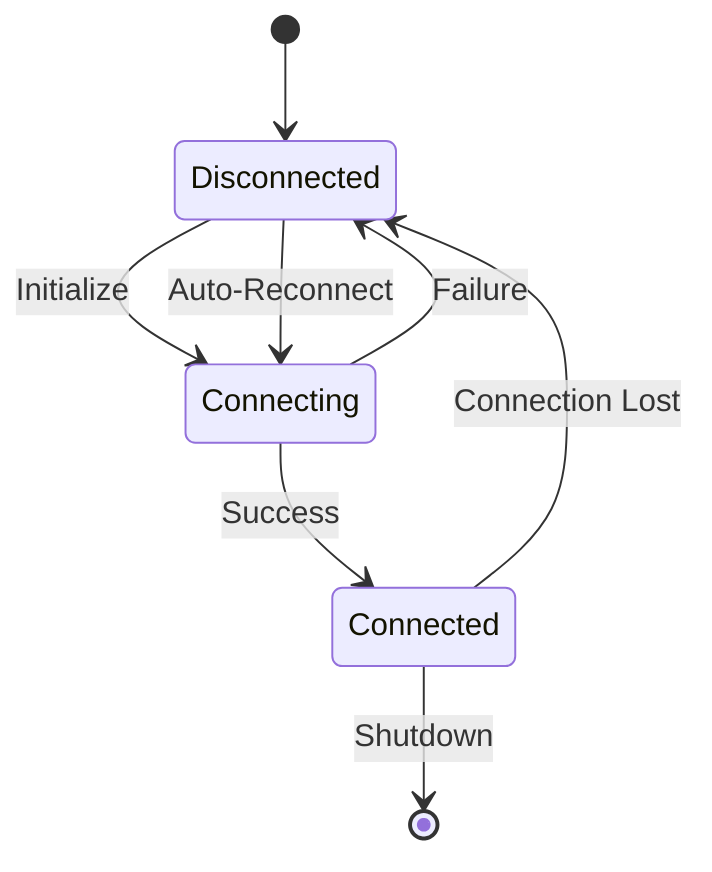
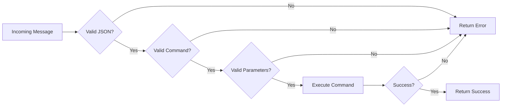
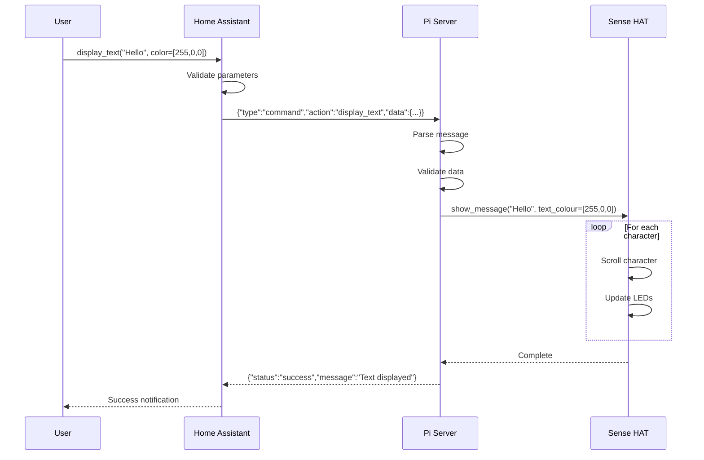
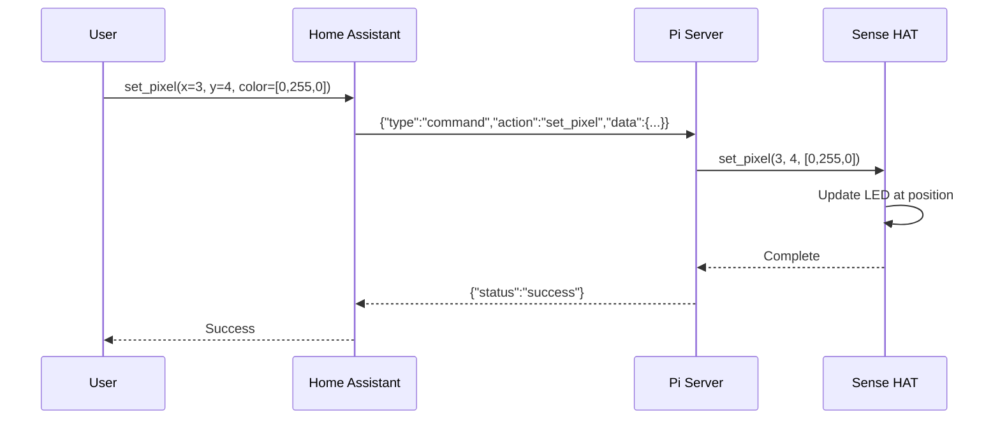
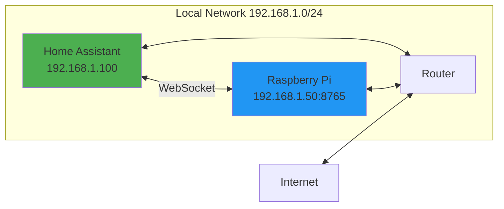
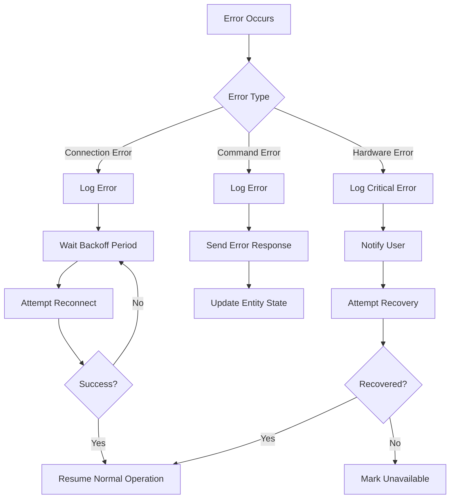
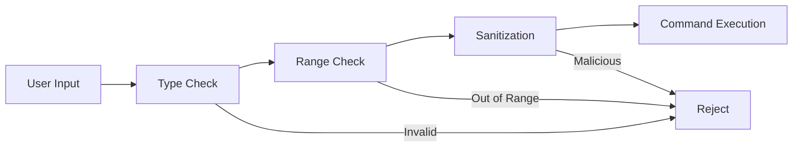
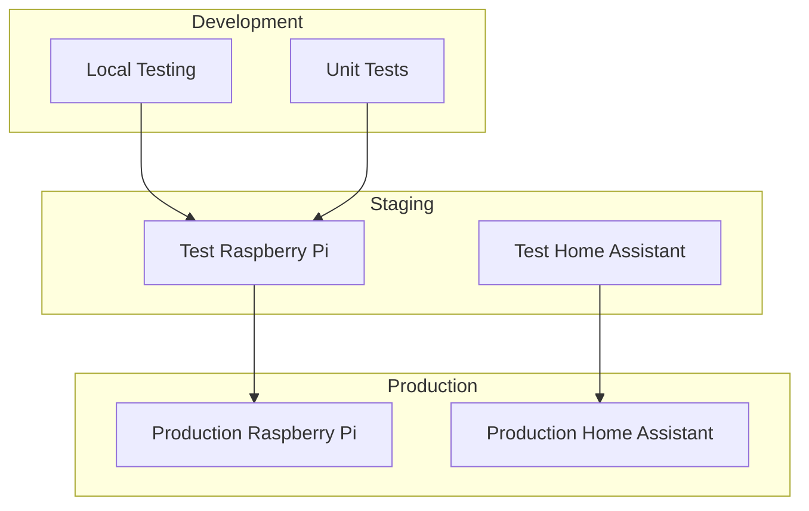

# System Architecture

## High-Level Overview

The Remote Sense HAT Control system consists of two main components that communicate over WebSocket:



## Communication Flow

### 1. Command Execution Flow



### 2. Connection Management



### 3. Message Processing Pipeline



## Component Details

### Raspberry Pi Server Components

#### WebSocket Server
- **Technology**: Python `websockets` library
- **Port**: 8765 (configurable)
- **Protocol**: WebSocket (ws://)
- **Concurrency**: Async/await pattern
- **Features**:
  - Multiple client support
  - Message validation
  - Error handling
  - Graceful shutdown

#### Display Controller
- **Technology**: Python `sense-hat` library
- **Features**:
  - Thread-safe operations
  - Animation queue
  - Brightness control
  - Rotation support
  - Predefined patterns

#### Configuration
- **Format**: YAML
- **Location**: `/opt/sense-hat-server/config.yaml`
- **Hot-reload**: No (requires restart)

### Home Assistant Component

#### Custom Integration
- **Domain**: `remote_sense_hat`
- **Platform**: Display
- **Configuration**: UI-based (config_flow)
- **Features**:
  - Auto-discovery (optional)
  - Multiple device support
  - Service registration
  - Entity state management

#### Entity Structure
```
remote_sense_hat.display
├── State: connected/disconnected
├── Attributes:
│   ├── brightness: 0.0-1.0
│   ├── rotation: 0/90/180/270
│   ├── last_command: string
│   ├── server_address: string
│   └── server_port: integer
└── Services:
    ├── display_text
    ├── set_pixel
    ├── set_pixels
    ├── clear
    ├── show_image
    ├── set_brightness
    └── set_rotation
```

## Data Flow

### Text Display Example



### Pixel Manipulation Example



## Network Architecture



### Network Requirements
- **Bandwidth**: Minimal (< 1 Kbps typical)
- **Latency**: < 100ms recommended
- **Ports**: 8765 (WebSocket)
- **Protocol**: TCP
- **Security**: Local network only (no external exposure)

## Error Handling Strategy



## Security Considerations

### Network Security
- WebSocket server binds to all interfaces (0.0.0.0) but should only be accessible on local network
- No authentication by default (trusted local network)
- Optional: Add token-based authentication
- Optional: Use WSS (WebSocket Secure) with TLS

### Input Validation


### Best Practices
1. Run server as non-root user
2. Use systemd for process management
3. Implement rate limiting for commands
4. Log all operations for audit trail
5. Keep software dependencies updated

## Performance Characteristics

### Latency Breakdown
- **Network transmission**: 1-10ms (local network)
- **Message parsing**: < 1ms
- **Display update**: 10-100ms (depends on operation)
- **Total end-to-end**: 15-150ms typical

### Throughput
- **Commands per second**: 10-50 (limited by display refresh)
- **Concurrent clients**: 5-10 (more than needed)
- **Message size**: < 1KB typical

### Resource Usage
- **Raspberry Pi CPU**: < 5% idle, < 20% during animations
- **Memory**: ~50MB for server process
- **Network**: < 1 Kbps average

## Scalability

### Current Design
- Single Raspberry Pi with one Sense HAT
- Single Home Assistant instance
- Multiple automations/scripts can use the display

### Future Expansion
- Multiple Sense HATs (multiple server instances)
- Load balancing (if needed)
- Command queuing for complex animations
- Distributed display coordination

## Deployment Architecture



## Monitoring and Logging

### Log Locations
- **Raspberry Pi**: `/var/log/sense-hat-server.log`
- **Systemd**: `journalctl -u sense-hat-server`
- **Home Assistant**: `config/home-assistant.log`

### Metrics to Monitor
- Connection status
- Command success rate
- Error frequency
- Response times
- Server uptime

### Health Checks
```python
# Simple health check endpoint
{
    "status": "healthy",
    "uptime": 3600,
    "connected_clients": 1,
    "commands_processed": 150,
    "errors": 2
}