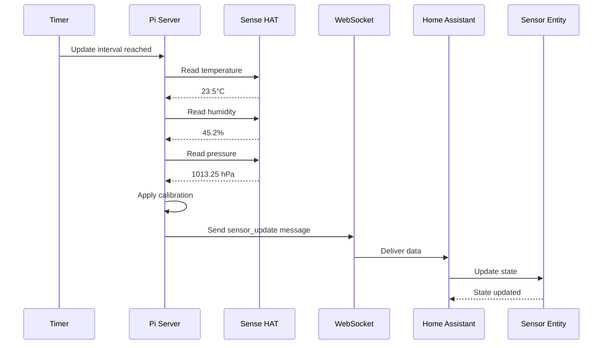

# Sensor Integration Guide

## Overview

The Raspberry Pi Sense HAT includes several environmental sensors that can be integrated into Home Assistant:

- **Temperature Sensor**: Measures ambient temperature
- **Humidity Sensor**: Measures relative humidity
- **Pressure Sensor**: Measures atmospheric pressure

This guide explains how these sensors are integrated and how to use them effectively.

## Sensor Specifications

### Temperature Sensor
- **Range**: -40°C to +120°C
- **Accuracy**: ±2°C
- **Resolution**: 0.01°C
- **Note**: The Sense HAT runs warm due to the Raspberry Pi CPU. A calibration offset is recommended.

### Humidity Sensor
- **Range**: 0% to 100% RH
- **Accuracy**: ±3% RH
- **Resolution**: 0.01% RH

### Pressure Sensor
- **Range**: 260 to 1260 hPa
- **Accuracy**: ±1 hPa
- **Resolution**: 0.01 hPa

## Data Flow



## Configuration

### Server Configuration

In [`raspberry_pi/config.yaml`](raspberry_pi/config.yaml):

```yaml
sensors:
  enabled: true
  update_interval: 60  # seconds
  temperature_offset: -5.0  # calibration offset in °C
  
  # Optional: smoothing
  smoothing:
    enabled: true
    window_size: 5  # number of readings to average
```

### Temperature Calibration

The Sense HAT typically reads 5-10°C higher than ambient due to heat from the Raspberry Pi. To calibrate:

1. Place a reference thermometer near the Raspberry Pi
2. Wait 30 minutes for temperature stabilization
3. Compare readings
4. Set `temperature_offset` to the difference (usually -5 to -10)

Example:
- Sense HAT reads: 28°C
- Reference thermometer: 22°C
- Offset: -6°C

```yaml
sensors:
  temperature_offset: -6.0
```

## Home Assistant Integration

### Automatic Entity Creation

When the integration is configured, three sensor entities are automatically created:

```yaml
sensor.sense_hat_temperature
sensor.sense_hat_humidity
sensor.sense_hat_pressure
```

### Entity Attributes

Each sensor entity includes:

```yaml
# Temperature Entity
sensor.sense_hat_temperature:
  state: "22.5"
  unit_of_measurement: "°C"
  device_class: "temperature"
  state_class: "measurement"
  friendly_name: "Sense HAT Temperature"
  last_updated: "2026-03-17T17:55:00Z"
  calibration_offset: -5.0
```

### Dashboard Card Example

```yaml
type: entities
title: Sense HAT Sensors
entities:
  - entity: sensor.sense_hat_temperature
    name: Temperature
    icon: mdi:thermometer
  - entity: sensor.sense_hat_humidity
    name: Humidity
    icon: mdi:water-percent
  - entity: sensor.sense_hat_pressure
    name: Pressure
    icon: mdi:gauge
```

### History Graph

```yaml
type: history-graph
title: Environmental Trends
entities:
  - entity: sensor.sense_hat_temperature
  - entity: sensor.sense_hat_humidity
  - entity: sensor.sense_hat_pressure
hours_to_show: 24
```

## Automation Examples

### Temperature-Based Display

```yaml
automation:
  - alias: "Display Temperature on LED"
    trigger:
      - platform: time_pattern
        minutes: "/5"  # Every 5 minutes
    action:
      - service: remote_sense_hat.display_text
        data:
          text: "{{ states('sensor.sense_hat_temperature') }}°C"
          text_color: >
            
            
              [0, 0, 255]
            
              [0, 255, 0]
            
              [255, 0, 0]
            
          scroll_speed: 0.1
```

### High Humidity Alert

```yaml
automation:
  - alias: "High Humidity Warning"
    trigger:
      - platform: numeric_state
        entity_id: sensor.sense_hat_humidity
        above: 70
    action:
      - service: remote_sense_hat.display_text
        data:
          text: "High Humidity!"
          text_color: [255, 165, 0]
          scroll_speed: 0.08
      - service: notify.mobile_app
        data:
          message: "Humidity is {{ states('sensor.sense_hat_humidity') }}%"
```

### Pressure Change Detection

```yaml
automation:
  - alias: "Pressure Drop Alert"
    trigger:
      - platform: numeric_state
        entity_id: sensor.sense_hat_pressure
        below: 1000
    action:
      - service: remote_sense_hat.display_text
        data:
          text: "Storm Coming?"
          text_color: [128, 0, 128]
```

### Cycling Sensor Display

```yaml
automation:
  - alias: "Cycle Sensor Display"
    trigger:
      - platform: time_pattern
        seconds: "/20"  # Every 20 seconds
    action:
      - choose:
          - conditions:
              - condition: template
                value_template: "{{ now().second % 60 < 20 }}"
            sequence:
              - service: remote_sense_hat.display_text
                data:
                  text: "T: {{ states('sensor.sense_hat_temperature') }}°C"
                  text_color: [255, 0, 0]
          - conditions:
              - condition: template
                value_template: "{{ now().second % 60 < 40 }}"
            sequence:
              - service: remote_sense_hat.display_text
                data:
                  text: "H: {{ states('sensor.sense_hat_humidity') }}%"
                  text_color: [0, 0, 255]
        default:
          - service: remote_sense_hat.display_text
            data:
              text: "P: {{ states('sensor.sense_hat_pressure') }}hPa"
              text_color: [0, 255, 0]
```

## Advanced Features

### Sensor Data Smoothing

To reduce noise in sensor readings, enable smoothing:

```yaml
sensors:
  smoothing:
    enabled: true
    window_size: 5  # Average last 5 readings
```

This is particularly useful for:
- Reducing temperature fluctuations
- Smoothing humidity changes
- Stabilizing pressure readings

### Custom Update Intervals

Different sensors can have different update intervals:

```yaml
sensors:
  update_interval: 60  # Default for all sensors
  
  # Override for specific sensors
  temperature:
    update_interval: 30  # Update every 30 seconds
  humidity:
    update_interval: 60
  pressure:
    update_interval: 120  # Update every 2 minutes
```

### Sensor Data Logging

Enable detailed logging for troubleshooting:

```yaml
logging:
  level: DEBUG
  sensors:
    log_readings: true
    log_file: /var/log/sense-hat-sensors.log
```

## Troubleshooting

### Sensor Readings Not Updating

1. Check server logs:
```bash
sudo journalctl -u sense-hat-server -f | grep sensor
```

2. Verify sensor configuration:
```bash
cat /opt/sense-hat-server/config.yaml | grep -A 5 sensors
```

3. Test sensors directly:
```python
from sense_hat import SenseHat
sense = SenseHat()
print(f"Temperature: {sense.get_temperature()}")
print(f"Humidity: {sense.get_humidity()}")
print(f"Pressure: {sense.get_pressure()}")
```

### Inaccurate Temperature Readings

1. Verify calibration offset is set
2. Ensure adequate ventilation around Raspberry Pi
3. Wait 30 minutes after boot for stabilization
4. Consider using CPU temperature compensation:

```python
# Advanced calibration
cpu_temp = get_cpu_temperature()
raw_temp = sense.get_temperature()
calibrated_temp = raw_temp - ((cpu_temp - raw_temp) / 5.0)
```

### Sensor Entity Not Appearing in Home Assistant

1. Check Home Assistant logs for errors
2. Verify WebSocket connection is active
3. Restart Home Assistant integration
4. Check entity registry:
   - Settings → Devices & Services → Remote Sense HAT → Entities

### Delayed Updates

1. Check update interval setting
2. Verify network latency
3. Monitor server CPU usage
4. Consider reducing smoothing window size

## Performance Considerations

### Update Frequency

- **Recommended**: 60 seconds for most use cases
- **Minimum**: 10 seconds (to avoid excessive CPU usage)
- **Maximum**: 300 seconds (5 minutes)

### Resource Usage

Typical resource usage per sensor reading:
- **CPU**: < 1% per reading
- **Memory**: ~1KB per reading
- **Network**: ~200 bytes per update

### Battery Impact

If running on battery power:
- Increase update interval to 300+ seconds
- Disable smoothing
- Consider on-demand updates only

## Integration with Other Systems

### InfluxDB

Store sensor data for long-term analysis:

```yaml
influxdb:
  host: localhost
  include:
    entities:
      - sensor.sense_hat_temperature
      - sensor.sense_hat_humidity
      - sensor.sense_hat_pressure
```

### Grafana

Create dashboards with historical sensor data:

1. Configure InfluxDB as data source
2. Create panels for each sensor
3. Set up alerts based on thresholds

### Node-RED

Use sensor data in complex flows:

```json
[
  {
    "id": "sensor_input",
    "type": "server-state-changed",
    "name": "Temperature Changed",
    "server": "home_assistant",
    "entityid": "sensor.sense_hat_temperature"
  }
]
```

## Best Practices

1. **Calibration**: Always calibrate temperature sensor
2. **Update Interval**: Balance between freshness and resource usage
3. **Smoothing**: Enable for stable readings
4. **Monitoring**: Set up alerts for unusual readings
5. **Documentation**: Document your calibration values
6. **Testing**: Verify accuracy with reference instruments
7. **Maintenance**: Recalibrate periodically (every 6 months)

## Future Enhancements

Planned features for sensor integration:

1. **Automatic Calibration**: Self-calibrating temperature offset
2. **Trend Analysis**: Built-in trend detection
3. **Anomaly Detection**: Alert on unusual patterns
4. **Weather Prediction**: Basic weather forecasting from pressure trends
5. **Display Integration**: Show sensor data on LED matrix automatically
6. **Historical Graphs**: Built-in visualization in Home Assistant